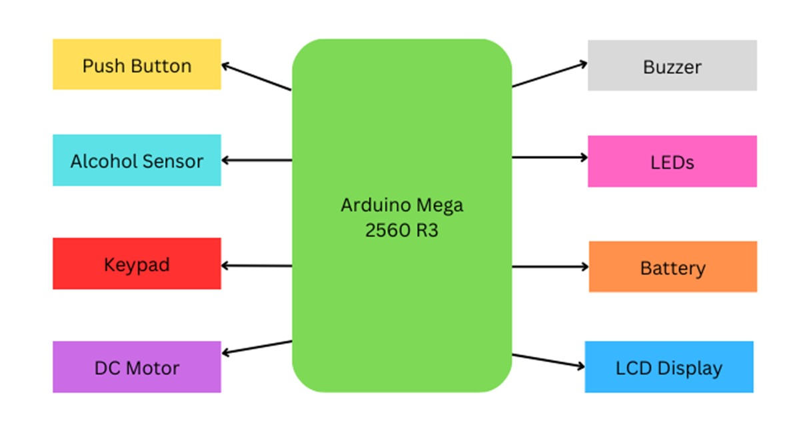

# 🚗 SecureDrive – Alcohol Detection & Vehicle Access Control System

SecureDrive is an embedded safety system designed to prevent drunk driving by detecting alcohol presence and enforcing PIN-based vehicle access control. The system integrates an alcohol sensor, keypad for PIN entry, motor driver to control vehicle motors, and alert indicators such as LEDs, buzzer, and an LCD display.

---

## 🔧 Features

- 🍷 **Alcohol Detection:** Continuously monitors alcohol concentration via an analog sensor.
- 🔐 **PIN-Based Access Control:** Vehicle operation is allowed only after entering the correct 4-digit PIN.
- 🚦 **Visual Indicators:** Red, yellow, and green LEDs indicate system status.
- 🔊 **Audible Alerts:** Buzzer sounds in case of alcohol detection or wrong PIN entry.
- 🖥️ **LCD Display:** Provides real-time feedback and instructions to the user.
- 🚗 **Motor Control:** Controls motor driver pins to start/stop vehicle motors based on system status.

---

## 📦 Hardware Components

| Component            | Description                         |
|----------------------|-----------------------------------|
| Arduino Uno          | Main microcontroller               |
| MQ-3 or equivalent   | Alcohol sensor                    |
| 4x4 Matrix Keypad    | User PIN input                    |
| L293D Motor Driver   | Motor control                     |
| 16x2 I2C LCD         | Status display                    |
| LEDs (Red, Yellow, Green) | Status indicators             |
| Buzzer               | Audible alarm                    |
| Power Supply         | 5V regulated power                |

---

## 📋 How It Works

1. **Alcohol Monitoring:** The system reads the alcohol sensor every 5 seconds.
2. **Alcohol Detected:** If alcohol levels exceed a threshold, the vehicle is locked, red LED blinks, buzzer sounds, and the LCD shows "Alcohol Detected".
3. **PIN Verification:** If no alcohol is detected, the user is prompted to enter a 4-digit PIN via the keypad.
4. **Access Granted:** On correct PIN entry, the vehicle motors run and the green LED lights up.
5. **Wrong PIN:** If PIN is incorrect, buzzer alerts and red LED blinks for 5 seconds, then the system resets.
6. **Motor Run:** Vehicle motors run for a fixed period then stop automatically.
7. **System Reset:** After stopping, the system resets to initial state.

---

## 🔌 Wiring Overview

- **Alcohol Sensor:** Connect sensor output to Arduino Analog Pin A0.
- **Keypad:** Connect rows to digital pins 6,7,8,9; columns to pins 10,11,12,13.
- **Motor Driver (L293D):** Motor1 control pins to Arduino pins 8 and 9; Motor2 control pins to pins 10 and 11.
- **LEDs:** Red (pin 3), Yellow (pin 4), Green (pin 5).
- **Buzzer:** Digital pin 2.
- **LCD:** I2C address `0x27` connected via SDA/SCL.

*Note: Make sure to provide common ground and appropriate power supply for all components.*

---

## 🚀 Getting Started

### Prerequisites

- [Arduino IDE](https://www.arduino.cc/en/software)
- Install required libraries:
  - `LiquidCrystal_I2C`
  - `Keypad`

### Uploading Code

1. Clone or download this repository.
2. Open `SecureDrive.ino` in Arduino IDE.
3. Connect your Arduino Uno via USB.
4. Select the correct board and COM port.
5. Upload the sketch.

---

## 📸 Block Diagram

---

## 🧠 Future Enhancements

- Integrate GSM module to send SMS alerts on alcohol detection.
- Add GPS module for location tracking.
- Implement mobile app for remote vehicle control.
- Extend alcohol detection sensitivity calibration.

---

## 🤝 Contribution

Contributions are welcome! Feel free to fork the repo, submit issues or pull requests.

---

## 📄 License

This project is licensed under the MIT License - see the [LICENSE](LICENSE) file for details.

---

## 📬 Contact

Developed by [Mohd Shameem S](https://github.com/mohd-shameem-s)  
For queries or collaborations, feel free to reach out!

---

⭐️ If you find this project useful, please give it a star!
